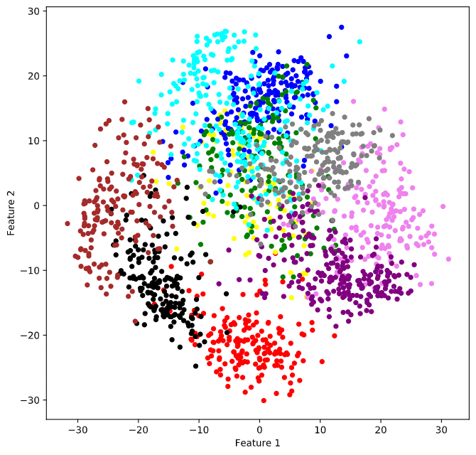

# PRML-CS5691-2021
<h2>Assignment1</h2>
<a href="Assignment1">Assignment 1</a>
<h3>Results</h3>
<h4>Decision Boundaries<h4>
 
<h4>ROC Curves<h4>
 
  
<h2>Assignment2</h2>
<a href="Assignment2">Assignment 2</a>
<h3>Results</h3>
<h4>Clusters<h4>
  
 
<h2>Assignment3</h2>
<a href="Assignment3">Assignment 3</a>
<h2>Data Contest</h2>
<a href="Data Contest">Data Contest</a> 
The Contest page can be accessed from here <a href="https://www.kaggle.com/c/prml-data-contest-jan-2021/overview">Link</a>. The Data Description is as shown below 
  
>Build recommendation models for a Music Platform and try to predict what ratings customers will assign to songs. You can use all the extra information provided, such as customers's  >previous rating scores, his/her list of songs saved for listening in future, labels assigned to songs etc.
> 
>Dataset contains ~1.3million ratings, split into about 700k training and 600k test ratings. There are about 14k distinct customers and 10k distinct songs. This dataset is derived from  >a real world scenario; so take care of sanitizing/handling real data.   
 

  
